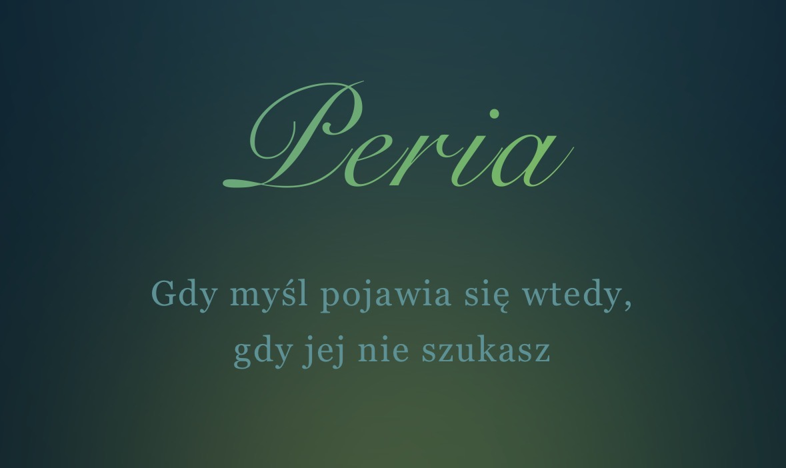

<p align="center">
  
</p>

<p align="center">
  
  
  
  
  
</p>

# Peria

**A personal idea capture and reflection app that turns spontaneous thoughts into structured notes using AI.**

Peria captures thoughts that emerge while moving — before they disappear — and organizes them into notes, checklists, events, or saved ideas.

---

## 🚀 Status & Demo

**Status:** Fully functional PWA  
**Live:** Install via browser (Add to Home Screen)

Peria works as a Progressive Web App — install it to your device and use offline or online.

---

## ✨ Core Features

- Capture thoughts by voice or text
- AI structure: chaos → notes (GPT-powered)
- Local storage-first (cloud sync planned)
- Walk Mode interface optimized for mobile
- Checklist and events generation
- Offline support via Service Worker

---

## 🖼 Screenshots

_Add screenshots here:_


---

## 🛠 Tech Stack

- React 19
- Vite
- SCSS
- OpenAI GPT / Whisper
- PWA

---

## 🧪 Local Setup

```bash
git clone https://github.com/enowuigrek/Peria.git
cd Peria
npm install
npm run dev
```

Runs at http://localhost:5173

---

## 📁 Project Structure (simplified)

```bash
src/
components/
utils/
agent.js
App.jsx
```

---

## 🎯 Project Highlights

- Captures ideas before they disappear
- AI-powered structure from chaos to clarity
- Designed for mobile spontaneous use
- Companion app, not just another notes tool

---

## 👤 Author

Created by Łukasz Nowak  
GitHub: https://github.com/enowuigrek

---

## 📄 License

Private project – All rights reserved
